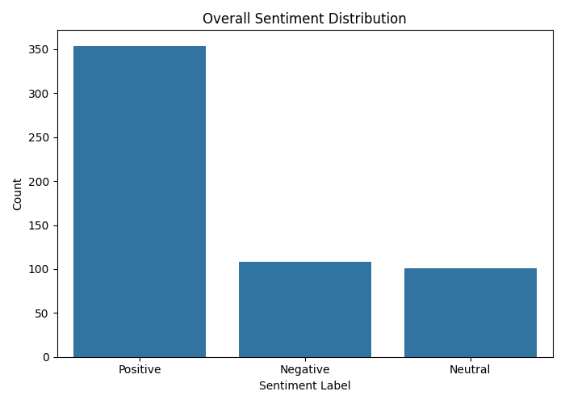
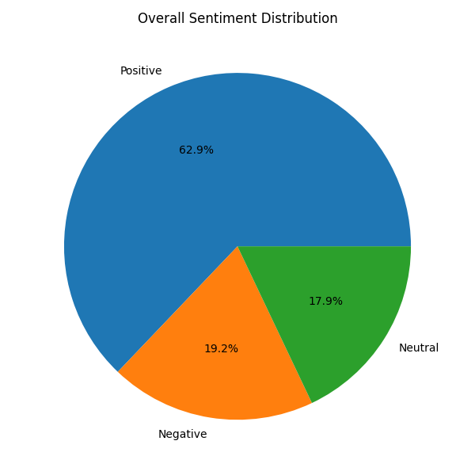
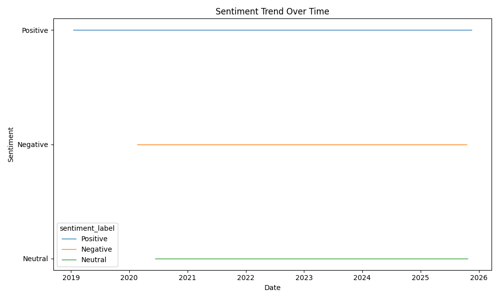
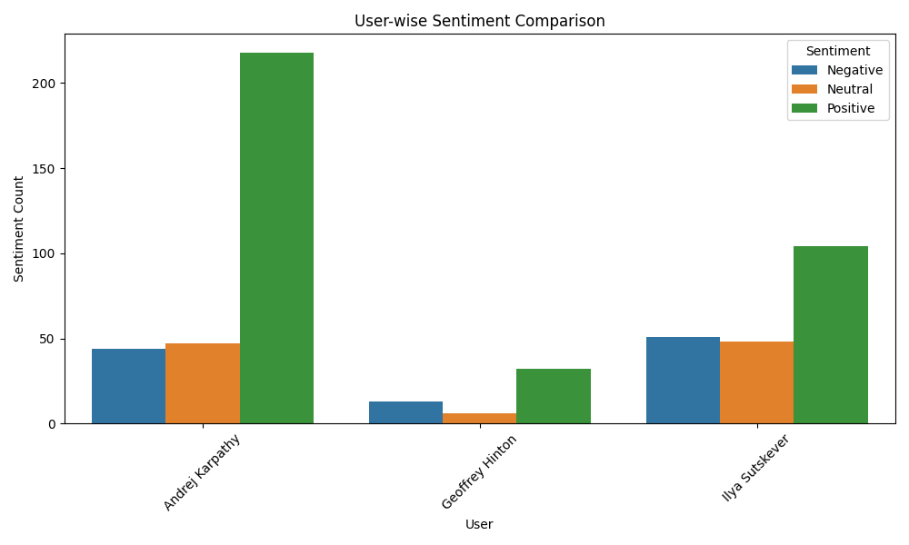

AI Thought Leaders – Sentiment Analysis Report
Tweets Scraped from Nitter (Alternative Twitter Front-End)
Prepared by: Dania Boban

1. Project Overview

This project analyzes public opinions expressed by three major AI researchers:

Geoffrey Hinton

Andrej Karpathy

Ilya Sutskever

Since X/Twitter restricts scraping, the project uses Nitter, a privacy-friendly frontend that allows scraping user timelines with Selenium.

The project performs:

Web scraping of tweets

Cleaning and preprocessing

Sentiment classification using VADER

User-level summary

Data visualisation

Insights & conclusions

 2. Data Scraping Summary

Tweets were scraped using Selenium-based automation.

Scraper:
src/NitterSentimentAnalysis/scraper_nt.py

Collected Fields:

Field	Description
profile_name	Name of the AI researcher
username	Twitter handle
text	Tweet content
created_at	Timestamp
likes / replies / retweets	Engagement metrics
urls	Any links inside tweets
flags	reply / retweet / quote

Total Raw Tweets:
📌 Geoffrey Hinton → 100+
📌 Andrej Karpathy → 300+
📌 Ilya Sutskever → 150+

(Exact counts depend on live scraping)

3. Data Cleaning Steps

Cleaning was done using:

📌 combine_csv.py
📌 sentiment_analysis.py

Cleaning included:

Removing URLs

Removing mentions (@username)

Removing emojis and special characters

Lowercasing

Removing empty rows

Removing duplicates

Final cleaned dataset:
📌 563 tweets

Saved as:
✔ cleaned_combined_tweets.csv
✔ all_users_tweets.csv

 4. Sentiment Analysis

Sentiment scoring was done using:
✔ VADER Sentiment Analyzer (best for social media text)

Each tweet is classified as:

Positive

Negative

Neutral

📊 Sentiment Counts (Overall)
Sentiment	Count
Positive	354
Negative	108
Neutral	101

Positive sentiment dominates across all three AI researchers.

 5. User-wise Sentiment Summary
User	Positive	Neutral	Negative
Andrej Karpathy	218	47	44
Geoffrey Hinton	32	6	13
Ilya Sutskever	104	48	51
Observations

Karpathy posts the most positive and technical content.

Sutskever has more negative sentiment, likely due to philosophical discussions and concerns.

Hinton has balanced but slightly more positive tweets.

 6. Visualisation Summary

Generated using:
✔ visualise_sentiment.py

Saved inside /plots/:

overall_sentiment_bar.png

overall_sentiment_pie.png

sentiment_trend.png

user_wise_sentiment_comparison.png

These visualizations clearly show:

Overall positivity

Temporal sentiment changes

Differences in sentiment across the three individuals

### Visualisations

#### Overall sentiment (bar)

#### Overall sentiment (pie)

#### Sentiment trend

#### User-wise comparison

 7. Key Insights
⭐ 1. AI researchers are mostly positive in their communication

A large portion of their tweets are motivational, technical, educational, or updates.

⭐ 2. Negative tweets mostly revolve around:

AI safety concerns

Ethical risks

Criticism of corporate decisions

Social/political commentary

⭐ 3. Neutral tweets include

Announcements

Event notifications

Paper releases

⭐ 4. Hinton shows more concern-related tweets

Likely due to his active stance on AI safety.

⭐ 5. Karpathy remains consistently positive

Reflects his role in promoting engineering and education.

 8. Conclusion

This sentiment analysis gives a clear view of how leading AI researchers communicate online.
Their sentiment patterns reflect:

Their roles in the AI community

Their personal communication styles

Their involvement in active debates and innovations

The project demonstrates:

✔ Web scraping
✔ Data cleaning
✔ NLP preprocessing
✔ Sentiment analysis
✔ Data visualization
✔ Reporting

A complete end-to-end NLP sentiment analysis pipeline.

 9. Files Generated
File	Purpose
all_users_tweets.csv	Combined raw scraped tweets
cleaned_combined_tweets.csv	Cleaned dataset
sentiment_results.csv	Sentiment output
user_sentiment_summary.csv	User-wise sentiment counts
/plots/	All visualizations
visualise_sentiment.py	Plot script